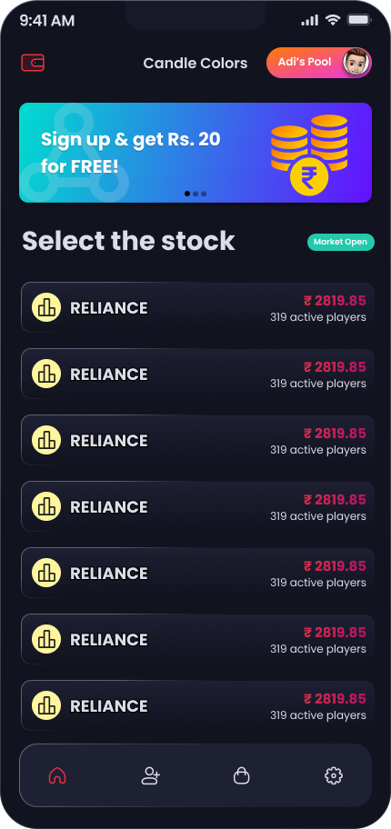
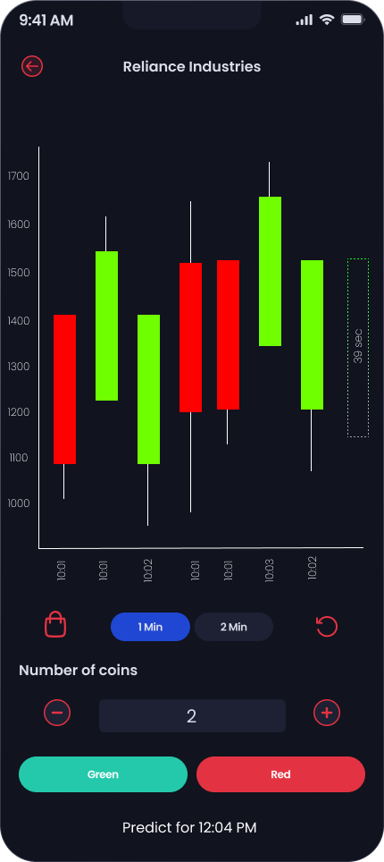

# Tikr

A Flutter stock-trading app: real-time price charts, an order/wallet flow, and prediction pools where users stake on where a price is headed.

## Features

- **Real-time prices** over WebSocket, rendered as candlestick and line charts (portrait and landscape) with Syncfusion charts
- **Search** for stocks and drill into a detail/chart page
- **Prediction pools** — buy into a pool and predict price direction, tracked via a ticket-purchase flow
- **Wallet** for balances and order history
- **OTP-based sign-in** and onboarding flow
- Secure local storage for session data (`flutter_secure_storage`)

## Screenshots

| Home | Chart |
|---|---|
|  |  |

## Stack

Flutter · GetX (`get`) and `provider` for state · `web_socket_channel` for live prices · `syncfusion_flutter_charts` + `candlesticks` for charting · `flutter_secure_storage`

## Running it locally

```bash
flutter pub get
flutter run
```

## Status

Core trading UI (home, search, charts, wallet, prediction pools, OTP sign-in) is built. This started as a learning project for real-time data and charting in Flutter, not a production trading product — no real money or brokerage integration.
